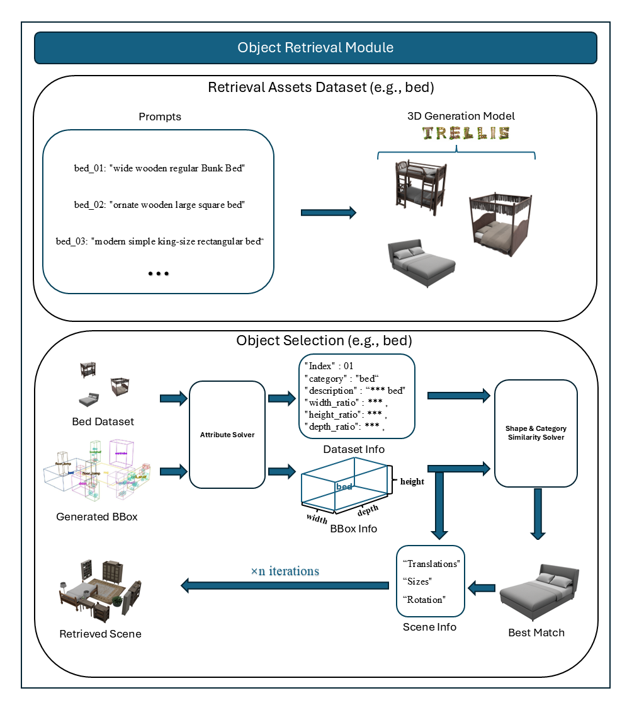

# Layout2Scene Object Retrieval

This repository provides a simple and scalable pipeline for **layout-to-scene object retrieval**, focusing on matching 3D room layouts with relevant 3D objects and rendering them for visualization.

## Method Overview

Our approach follows a straightforward workflow:

1. **Layout Parsing** – Read the input layout file and extract room and object placement information.
2. **Object Retrieval** – For each object category in the layout, retrieve candidate 3D models from a pre-built object index for shape similarity.
3. **Scene Composition** – Assemble the retrieved 3D objects into a coherent scene according to the layout constraints.
4. **Rendering** – Render the composed scene using Blender with specified resolution and camera settings.

This pipeline is designed to be **lightweight, reproducible, and extensible**, enabling researchers to quickly test layout-based scene generation and retrieval tasks.


<div align="center">
  
  <p style="text-align: center, margin-top: 5px">Object retrieval flowchart</p>
</div>

## Installation
Clone our repo:
```bash
git clone https://github.com/Graphic-Kiliani/Object-Retrieval-Layout2Scene.git
```
Download Blender's latest version:
```bash
# Blender 4.5.3 
wget https://mirror.freedif.org/blender/release/Blender4.5/blender-4.5.3-linux-x64.tar.xz
tar -xzvf blender-4.5.3-linux-x64.tar.xz -C <path_to_target_dir>
```
## Dataset

We use a curated dataset containing 3D objects categorized by type, designed to support layout-based retrieval tasks. Our retrieval dataset **includes 95 objects** which covers nearly all common indoor objects.

- **Dataset link:** [Download Here](https://pan.baidu.com/s/1Xxopue8EjIelQxhDkSoK6Q?pwd=p4cj)

<div align="center">
  <table>
    <thead>
      <tr>
        <th style="text-align: center; vertical-align: middle;"><strong>Category</strong></th>
        <th style="text-align: center; vertical-align: middle;"><strong>Objects (95 in total)</strong></th>
      </tr>
    </thead>
    <tbody>
      <tr>
        <td style="text-align: center; vertical-align: middle;"><strong>Lighting</strong></td>
        <td style="text-align: center; vertical-align: middle;">lighting, ceiling-lamp, pendant.lamp, floor.lamp, desk.lamp, fan</td>
      </tr>
      <tr>
        <td style="text-align: center; vertical-align: middle;"><strong>Tables</strong></td>
        <td style="text-align: center; vertical-align: middle;">table, coffee_table, console_table, corner_side_table, round_end_table, dining_table, dressing_table, side_table, nightstand, desk, tv_stand</td>
      </tr>
      <tr>
        <td style="text-align: center; vertical-align: middle;"><strong>Seating</strong></td>
        <td style="text-align: center; vertical-align: middle;">seating, chair, lounge_chair, chinese_chair, dining_chair, dressing_chair, stool, sofa, loveseat_sofa, l_shaped_sofa, multi_seat_sofa</td>
      </tr>
      <tr>
        <td style="text-align: center; vertical-align: middle;"><strong>Beds</strong></td>
        <td style="text-align: center; vertical-align: middle;">bed, kids_bed</td>
      </tr>
      <tr>
        <td style="text-align: center; vertical-align: middle;"><strong>Shelves & Book storage</strong></td>
        <td style="text-align: center; vertical-align: middle;">shelf, shelving, large_shelf, cell_shelf, bookshelf, book, book_column, book_stack, nature_shelf_trinkets</td>
      </tr>
      <tr>
        <td style="text-align: center; vertical-align: middle;"><strong>Cabinets & Wardrobes</strong></td>
        <td style="text-align: center; vertical-align: middle;">cabinet, kitchen_cabinet, children_cabinet, wardrobe, wine_cabinet</td>
      </tr>
      <tr>
        <td style="text-align: center; vertical-align: middle;"><strong>Appliances & Electronics</strong></td>
        <td style="text-align: center; vertical-align: middle;">appliances, microwave, oven, beverage_fridge, tv, monitor, tv_monitor</td>
      </tr>
      <tr>
        <td style="text-align: center; vertical-align: middle;"><strong>Kitchen & Tableware</strong></td>
        <td style="text-align: center; vertical-align: middle;">pan, pot, plate, bowl, cup, bottle, can, jar, wineglass, chopsticks, knife, fork, spoon, food_bag, food_box, fruit_container</td>
      </tr>
      <tr>
        <td style="text-align: center; vertical-align: middle;"><strong>Bathroom fixtures</strong></td>
        <td style="text-align: center; vertical-align: middle;">bathtub, shower, sink, standing_sink, toilet, toilet_paper, toiletry, faucet, towel</td>
      </tr>
      <tr>
        <td style="text-align: center; vertical-align: middle;"><strong>Doors, Windows & Coverings</strong></td>
        <td style="text-align: center; vertical-align: middle;">glass_panel_door, lite_door, window, blinds, curtain, vent</td>
      </tr>
      <tr>
        <td style="text-align: center; vertical-align: middle;"><strong>Hardware & Controls</strong></td>
        <td style="text-align: center; vertical-align: middle;">hardware, handle, light_switch</td>
      </tr>
      <tr>
        <td style="text-align: center; vertical-align: middle;"><strong>Decor</strong></td>
        <td style="text-align: center; vertical-align: middle;">plant, large-plant-container, plant-container, vase, wall_art, picture, mirror, statue, basket, balloon, cushion, rug, decoration</td>
      </tr>
      <tr>
        <td style="text-align: center; vertical-align: middle;"><strong>Containers & Waste</strong></td>
        <td style="text-align: center; vertical-align: middle;">bag, box, container, clutter, trashcan</td>
      </tr>
      <tr>
        <td style="text-align: center; vertical-align: middle;"><strong>Architecture & Elements</strong></td>
        <td style="text-align: center; vertical-align: middle;">counter, fireplace, pipe, furniture</td>
      </tr>
      <tr>
        <td style="text-align: center; vertical-align: middle;"><strong>Clothes</strong></td>
        <td style="text-align: center; vertical-align: middle;">clothes</td>
      </tr>
      <tr>
        <td style="text-align: center; vertical-align: middle;"><strong>Spaces</strong></td>
        <td style="text-align: center; vertical-align: middle;">kitchen_space</td>
      </tr>
      <tr>
        <td style="text-align: center; vertical-align: middle;"><strong>Gym & Misc</strong></td>
        <td style="text-align: center; vertical-align: middle;">gym_equipment</td>
      </tr>
    </tbody>
  </table>
</div>
                                                                                                                         
<p style="text-align: center; white-space: nowrap; margin-top: 5px;">Category list of retrieval objects</p>

You can also add your desired object category and 3D assets according to our dataset format. However, in order to correctly integrate with our object retrieval process, you should **first uniform the orientation within specific category under your model's/platform's coordinate system**, and **index the size information** for calculating shape similarity with following code:

```bash
# Processing the whole root dir
python build_glb_index.py --input-path <path_to_dataset_dir>

# Processing Single Category
python build_glb_index.py --input-path <path_to_added_category_dir>
```
Afterwards, you will obtain or see changes in glb_index.json file.

## Test Input

We provide an example JSON file containing room layout information for testing and reproducing results.

- **Test JSON link:** `assets/test.json`

## Usage

### Scene
After downloading the dataset and the test JSON file, modify the json path and dataset path in main.py, you can run:

See arguments'definition in main.py:

```bash
<path_to_blender> --background --python main.py -- \
    --input_json <path_to_room_json> \
    --out_dir    <output_dir_path> \
    --obj_folder <retrieval_assets_dir_path> \
    --glb_index  <glb_json_path> \
    --save_blend \
    --scene_id <num>
    --colorize
```
Besides, you can palette your favourite color in `colors_mapping.json` when you turn on  `--colorize` to get pure colorful topdown images.

#### Rendering vis
Afterwards, you will obtain corresponding topdown.png and scene.blend according to your input scene info json.
<table>
  <tr>
    <td align="center">
      <br/>
      <sub>Bedroom</sub>
    </td>
    <td align="center">
      <br/>
      <sub>Diningroom</sub>
    </td>
    <td align="center">
      <br/>
      <sub>Livingroom</sub>
    </td>
  </tr>
</table>

#### Multiple Rendering choices
The first row displays the retrieved 3D scenes' renderings with pure color schemes. The second row shows the retrieved 3D scenes' renderings with original textures applied. The pure color renderings eliminate the influence of textures, making it easier to assess the layout's alignment and object retrieval accuracy using metrics like FID and KID. Meanwhile, the textured renderings offer a visually richer evaluation and applications for users.
<div align="center">
 
 <p style="text-align: center; margin-top: 5px;">Object retrieval visualization</p>
</div>

### Layout vis
We provide tools to visualize layout in image or gif form. Before that, you only need to convert your scene info json format into ours. (Check it in Test JSON link)

See arguments'definition in visualization_mlayout.py
```bash
python visualization_mlayout.py <path_to_room_json> --scene_id <num> --label_small --small_thresh <num> --flipover --azimuth_offset <num>
```
<table>
  <tr>
    <td align="center">
      <br/>
      <sub>Bedroom</sub>
    </td>
    <td align="center">
      <br/>
      <sub>Diningroom</sub>
    </td>
    <td align="center">
      <br/>
      <sub>Livingroom</sub>
    </td>
  </tr>
</table>


